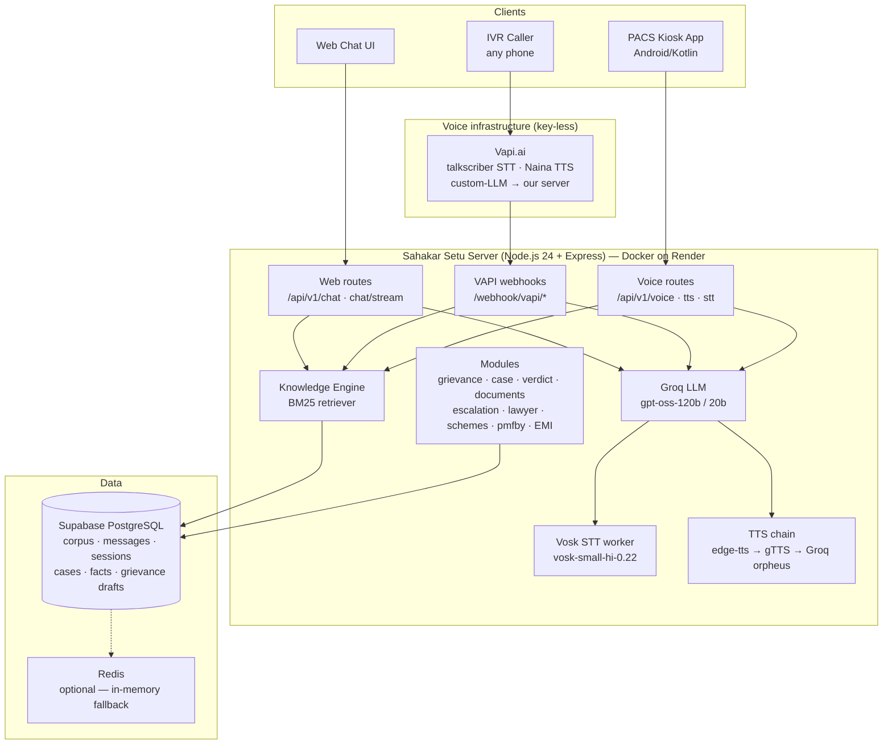

# Sahakar Setu — सहकार सेतु

**Multilingual, Hindi-first Cooperative Governance & Legal Assistance Platform**
Ministry of Cooperation | NCCT Hackathon (PS 26088)

> One backend. Three channels. **IVR phone call (VAPI) · PACS Assist Kiosk (Android) · Web chat** — all served by this single Node.js server with a grounded RAG knowledge engine, voice pipeline, case management, grievance drafting, and legal guidance in 11 Indian languages.

Production URL: `https://sahakar-setu-server.onrender.com` · Health: `GET /health` · Metrics: `GET /metrics`

---

## 1. The Problem

India has ~8.5 lakh cooperative societies and ~30 crore cooperative members. A large share are rural farmers with limited literacy — who:

- Cannot navigate complex cooperative laws, PMFBY crop insurance rules, or PACS services
- Live where internet and smartphones are scarce — but a simple phone call works everywhere
- Cannot draft formal grievance applications (language barrier + procedure)
- Have no single place that answers in **their language** (Hindi-first, 11 languages)

## 2. The Solution

**Sahakar Setu** is a conversational bridge between cooperative members and the system, delivered through three channels that share one brain:

| Channel | User | Interface |
|---|---|---|
| **IVR (phone call)** | Any farmer with any phone | Call +91-34699-86840, speak in Hindi — voice AI answers from verified sources |
| **PACS Assist Kiosk** | Members at PACS centres | Android kiosk (Samsung A03) — call-style voice UI, grievance drafting + thermal-printed receipts |
| **Web chat** | Anyone | RAG chatbot with citations, streaming, EMI/premium calculators |

### Feature highlights

- **Grounded answers only** — every answer cites the source passage; unverifiable questions get an honest refusal ("Mere paas iska verified jawab nahi hai"), never hallucination
- **Domain boundary** — the assistant stays strictly inside: cooperative law, government schemes, PACS services, PMFBY, financial literacy, grievance redressal
- **Voice-first design** — single-round-trip voice API (STT + LLM + TTS in one call), tuned for latency on free-tier infra
- **Grievance drafting** — conversational fact collection → formal Hindi application → tracking ID (`SS-2026-000007`) → printable at kiosk
- **Case strength meter** — verdict engine scores each case 0–100 and tells the member exactly what evidence is missing
- **Document scanning** — upload FIR / sale deed / notice / land record → OCR (Tesseract) → facts auto-extracted into the case
- **Escalation ladder** — Society → Registrar → Ombudsman → Legal aid, with statutory timelines
- **Lawyer connect** — cases scoring ≥ 60 are matched to a verified (legal-aid) advocate
- **Calculators & quizzes** — EMI calculator, PMFBY premium calculator, scheme eligibility checker
- **Financial literacy** — audio lessons in Hindi (offline-playable MP3s)

---

## 3. System Architecture



**One brain, many mouths** — IVR, kiosk and web all call the same `retrieve() + generateAnswer()` core; only transport and audio differ.

---

## 4. Tech Stack — and *why* each piece

| Layer | Technology | Why this choice |
|---|---|---|
| Runtime | **Node.js 24** (Express) | Single language across web + voice; native WebSocket (Supabase client requirement); free hosting friendly |
| Language | **TypeScript** | Type-safe contracts for 25+ endpoints; `zod` env validation |
| LLM | **Groq** `openai/gpt-oss-120b` (text) / `gpt-oss-20b` (voice-first) | Fastest free-tier inference; 8000 TPM / 200K TPD free quota; LPU hardware ~2–3× faster than GPU clouds |
| RAG | **BM25 keyword retriever** over Supabase `corpus_passages` | Deterministic, zero-cost, explainable ranking (k1=1.2, b=0.75) — beats embeddings for Hindi legal terminology; no embedding API costs |
| Database | **Supabase (PostgreSQL)** | Managed, free tier, REST + JS client; corpus, conversations, cases, grievance drafts |
| STT | **Vosk** `vosk-small-hi-0.22` (local, persistent Python worker) | 100% offline & free, runs on 0.1 CPU, no API key — ideal for kiosk privacy + cost |
| TTS | **edge-tts → gTTS → Groq orpheus** fallback chain | edge-tts (MadhurNeural) best quality at home; Microsoft blocks datacenter IPs, so gTTS answers on cloud; orpheus as last resort |
| IVR | **Vapi.ai** (talkscriber/whisper STT, vapi/Naina TTS, custom-LLM → our server) | Key-less providers (account has zero provider credentials); custom-LLM keeps the brain on our server |
| Docs/OCR | **Tesseract.js** + `pdf-parse` pipeline | In-process OCR for FIR/deeds — no external service |
| Queues | **BullMQ + Redis** (optional) | Graceful degradation to in-memory cache when Redis is absent |
| Observability | **pino** + **prom-client** | Structured logs + Prometheus metrics (`/metrics`) |
| Container | **Docker** `node:24-slim` + Python 3 + ffmpeg | One image: Node server + Python STT/TTS workers + audio tools |
| Hosting | **Render free tier** (Blueprint `render.yaml`) | Zero cost, auto-deploy on git push, HTTPS; UptimeRobot ping keeps it awake |
| Tests | **Vitest** (unit + integration + eval) | 31 tests incl. boundary-message exactness, decline guard, citation grounding |

---

## 5. Codebase Structure

```
sahakar-setu-server/
├── src/
│   ├── index.ts                  # Express app, routes mount, WS server, graceful shutdown
│   ├── config/                   # env (zod), logger (pino)
│   ├── middleware/               # rate limit, request logger, error handler, HMAC auth (defined)
│   ├── db/                       # Supabase client + health check
│   ├── services/                 # metrics (prom-client), cache (Redis + memory fallback)
│   ├── utils/                    # citation extraction, tracking IDs, helpers
│   ├── channels/
│   │   ├── web/                  # POST /api/v1/chat (+ SSE /chat/stream), WS /ws/*
│   │   ├── ivr/                  # VAPI custom-LLM, call report, transcriber webhooks
│   │   ├── whatsapp/             # Twilio WhatsApp inbound
│   │   └── sms/                  # Twilio SMS inbound
│   └── modules/
│       ├── rag/retriever.ts      # BM25 + HINGLISH_MAP keyword normalisation
│       ├── llm/groq.ts           # generateAnswer, cited answers, boundary & decline guards
│       ├── language/detector.ts  # franc-min + Devanagari script detection
│       ├── stt/vosk.ts           # persistent vosk_worker.py bridge (transcribeWav)
│       ├── tts/edge.ts           # TTS chain: edge-tts worker → gTTS worker → Groq orpheus
│       ├── voice/routes.ts       # /api/v1/voice (STT+LLM+TTS single round trip), /tts, /stt
│       ├── chat-log/             # storeTurn / getRecentTurns (messages table)
│       ├── case/                 # case + verdict (0–100 strength score)
│       ├── case-memory/          # fact extraction + storage (fact_key/fact_value)
│       ├── grievance/            # draft generation (handlebars Hindi templates) + tracking
│       ├── document-scan/        # multipart upload, OCR, fact extraction
│       ├── escalation/           # Society→Registrar→Ombudsman→Legal aid ladder
│       ├── laws/                 # lawyer connect (score ≥ 60 gate)
│       ├── financial-literacy/   # EMI calculator + audio lessons
│       ├── pmfby/                # premium calculator
│       ├── schemes/              # list + eligibility quiz
│       └── pacs/                 # PACS services knowledge
├── scripts/
│   ├── vosk_worker.py            # persistent STT worker (JSON-lines over stdin/stdout)
│   ├── tts_service.py            # edge-tts worker
│   ├── gtts_service.py           # gTTS worker
│   ├── embed_service.py          # corpus embedding pipeline (dev)
│   └── ingest-corpus.ts          # corpus ingestion (dev)
├── models/                       # vosk-model-small-hi-0.22 (committed, ~79 MB)
├── corpus/                       # authored knowledge docs (markdown)
├── templates/                    # handlebars grievance templates
├── Dockerfile                    # node:24-slim + python3 + ffmpeg + vosk/edge-tts/gTTS
├── render.yaml                   # Render Blueprint (free web service)
└── requirements-runtime.txt      # vosk, edge-tts, gTTS
```

---

## 6. How a Query Becomes a Cited Answer (RAG pipeline)

1. **Language detect** — franc-min + Devanagari script heuristic
2. **Query normalisation** — `HINGLISH_MAP` maps spoken Hinglish ("mscs", "banne", "loan kaise milega") to canonical Hindi terms ("membership", "eligibility", "ऋण")
3. **Retrieval** — BM25 over 333 curated passages in Supabase `corpus_passages` (k1=1.2, b=0.75; bigram boost +3.0, phrase boost +2.5; deterministic `ORDER BY id`)
4. **Prompt build** — top passages truncated (700 chars text / 250 chars voice) + recent conversation history + behavioural rules (react to the user's actual words, never repeat phrasing, one follow-up question when details are missing)
5. **Generation** — Groq (temperature 0.3 text / 0.7 voice) with strict citation format `[Source: doc, §n]`
6. **Grounding check** — if passages existed but the answer has no citation → one retry with a citation-enforcement message (`groundingRetriesTotal` metric)
7. **Honesty guards** —
   - **Decline:** no useful passages → exactly `"Mere paas iska verified jawab nahi hai."` (never gets a fake citation grafted on)
   - **Boundary:** off-domain question → the exact domain-boundary message (Devanagari variations like सिर्फ/। auto-canonicalised back to the exact string)
8. **Storage** — every turn persisted to `messages` (session_id, role, content, meta) — failures only warn, never block the answer

The corpus was authored from 6 source documents: cooperative law core, PACS services, PMFBY operations, grievance redressal, financial literacy, and ministry schemes.

---

## 7. Voice Pipeline (kiosk & IVR)

### Kiosk call — ONE round trip
```
Phone mic → 16 kHz mono WAV (base64) → POST /api/v1/voice
  → Vosk worker transcribes (persistent process, model pre-warmed at boot)
  → retrieve() + generateAnswer() (voice: 20b model first, 250-char passages, last 4 turns)
  → TTS chain synthesises answer audio
→ { transcript, answer, citations, audio: base64 MP3 }
```
~7–10 s total on free-tier hardware.

### IVR call
```
Caller speaks → Vapi (talkscriber whisper, hi) → POST /webhook/vapi/<secret>/chat/completions
→ same retrieve() + generateAnswer() core → OpenAI-compatible response (SSE streaming supported)
```
Protected by `VAPI_LLM_SECRET` (path/query/Bearer, any accepted). Vapi does only telephony + STT/TTS — knowledge is 100% our corpus.

### TTS fallback chain (why it exists)
Microsoft's Bing readaloud (edge-tts) **403-blocks datacenter IPs** (works from home IPs). Chain: `edge-tts (MadhurNeural, rate +5%) → gTTS (Google Translate, cloud-safe) → Groq orpheus-v1-english (last resort)`. Results are cached (memory + Redis, 24 h).

---

## 8. Case Management Flow (the "legal assistant" half)

```
Conversation collects facts (name, village, district, loss, crop, date…)
        ↓  extractFacts() → cases + case_facts (camelCase API / snake_case DB)
Upload FIR / sale deed / notice → OCR → extracted_facts auto-merged
        ↓
Verdict engine scores 0–100 → band (needs_evidence / ready …) + missing_items list
        ↓
Grievance draft (handlebars Hindi template) → tracking ID SS-YYYY-NNNNNN
        ↓
Track by ID · escalate (Society→Registrar→Ombudsman→Legal aid) · lawyer connect at ≥ 60
        ↓
Kiosk prints thermal receipt (ESCPOS) — fully offline-usable
```

---

## 9. Storage Model (Supabase)

| Table | Purpose |
|---|---|
| `corpus_passages` | 333 knowledge passages + embeddings (0 NULL) — the RAG source of truth |
| `messages` | Every turn from every channel (session_id, role, content, meta JSONB) |
| `sessions` | Conversation containers; IVR sessions keyed `external_ref = 'vapi:<callId>'` |
| `cases` | Case header: category, status, strength_score, language |
| `case_facts` | fact_key / fact_value pairs (snake_case in DB, camelCase in API) |
| `grievance_drafts` | Generated applications + tracking IDs (no `status` column!) |
| `documents` | Uploaded FIR/deeds + OCR text + summaries |

---

## 10. Performance Engineering (free-tier constraints)

| Problem | Solution | Result |
|---|---|---|
| Python STT/TTS workers spawn per request | **Persistent workers** — spawned once at boot, JSON-lines protocol, pre-warmed models | STT 7 s → ~2 s |
| Big prompts on rate-limited Groq | Passage truncation 700/250 chars, history slice 6/4 turns | Under TPM caps |
| Voice latency | Voice channels use 20b model first (120b as backup), temp 0.7 for natural speech | ~8–10 s full voice round trip |
| 3 HTTP round trips (kiosk) | Single `POST /api/v1/voice` (STT+LLM+TTS) | 1 round trip |
| Repeated phrases (greetings, boundary) | TTS cache 24 h (memory + Redis) | Instant audio |
| Render free tier sleeps | UptimeRobot `/health` ping every 5 min | Always warm for demos |
| Windows cp1252 pipe corruption | `reconfigure(encoding='utf-8')` in all Python workers | Devanagari survives pipes |

Metrics (Prometheus at `/metrics`): latency histograms, grounding retries, fallback TTS usage, per-channel counters.

---

## 11. Deployment

```bash
# Local dev
npm install && npm run dev          # http://localhost:3000

# Production — Render (Docker)
git push origin main                # auto-deploys (Blueprint render.yaml, plan: free)
```

- **Image:** `node:24-slim` + `python3`, `python-is-python3`, `ffmpeg` + pip `vosk`, `edge-tts`, `gTTS` (`--break-system-packages` for PEP 668)
- **Env vars** (Render dashboard): `SUPABASE_URL`, `SUPABASE_ANON_KEY`, `SUPABASE_SERVICE_KEY`, `GROQ_API_KEY`, `HMAC_SECRET`, `VAPI_API_KEY`, `VAPI_LLM_SECRET`, `VAPI_PUBLIC_BASE_URL`, dummy `DATABASE_URL`/`REDIS_URL`
- **Keep-alive:** free tier sleeps after 15 min idle — UptimeRobot monitors `GET /health` every 5 min
- **VAPI assistant:** `model.url = https://sahakar-setu-server.onrender.com/webhook/vapi/<VAPI_LLM_SECRET>` (Vapi appends `/chat/completions`; the secret lives in the path segment)
- **Kiosk app:** `SettingsActivity.DEFAULT_URL` → Render URL (saved ngrok URLs auto-migrate)

---

## 12. Testing & Quality Gates

- `npm test` — 31 Vitest tests: unit (retriever, citations, verdict, calculators) + integration (chat, voice, grievance, boundary/decline exactness)
- Eval suite — all 13 guide queries must rank the correct source in top-3 (premium passage ranks #1 for "PMFBY premium kya hai?")
- Boundary discipline — the exact refusal/domain-boundary strings are enforced by prompt + output canonicalisation + tests (7 refusal / 2 pass)
- `npm run typecheck` before every push; deploy verified against the live Render URL

---

## 13. API Quick Reference

Full documentation: **`API.md`** (request/response JSON + curl examples for all 25+ endpoints).

| Need | Endpoint |
|---|---|
| Text chat (with citations) | `POST /api/v1/chat` · SSE: `POST /api/v1/chat/stream` |
| Voice call (one round trip) | `POST /api/v1/voice` |
| TTS / STT alone | `POST /api/v1/tts` · `POST /api/v1/stt` |
| Case + strength score | `GET /api/v1/case/:caseId` · `GET /api/v1/case/:caseId/verdict` |
| Grievance draft + track | `POST /api/v1/grievance/draft` · `GET /api/v1/grievance/track/:trackingId` |
| Document upload (OCR) | `POST /api/v1/document/upload` (multipart) |
| Escalation ladder | `POST /api/v1/escalation/path` |
| Lawyer connect | `POST /api/v1/lawyer/connect` |
| EMI / premium / eligibility | `POST /api/v1/financial/emi` · `POST /api/v1/pmfby/premium` · `POST /api/v1/scheme/eligibility` |
| Financial literacy audio | `GET /api/v1/financial/lessons/:language` · `GET /api/v1/financial/lessons/:id/audio` |
| IVR (Vapi) | `POST /webhook/vapi/:secret/chat/completions` |
| WhatsApp / SMS | `POST /webhook/twilio/whatsapp` · `POST /webhook/twilio/sms` |

---

## 14. Suggested Live Demo Flow (for judges)

1. **IVR**: dial +91-34699-86840 → speak "PMFBY premium kya hai?" → Hindi voice answer with source (no internet on the caller's phone — just a call)
2. **Kiosk**: press the call button → speak a crop-loss story → watch facts appear in the case → print the grievance receipt (thermal printer)
3. **Web**: ask the same question → cited answer + stream; ask "Kal ka mausam kaisa rahega?" → polite domain-boundary refusal (honesty over hallucination)
4. **Depth**: upload a FIR photo → verdict score rises → escalation ladder → lawyer connect gate

---

## 15. Future Scope

- WhatsApp Business integration (endpoint already stubbed)
- Embedding-based hybrid retrieval (BM25 + vector) behind a flag
- District-wise grievance escalation integration with state registrars
- Offline-first kiosk mode with local cache + sync
- Multi-lingual voice (Marathi/Tamil) via region-specific vosk models
